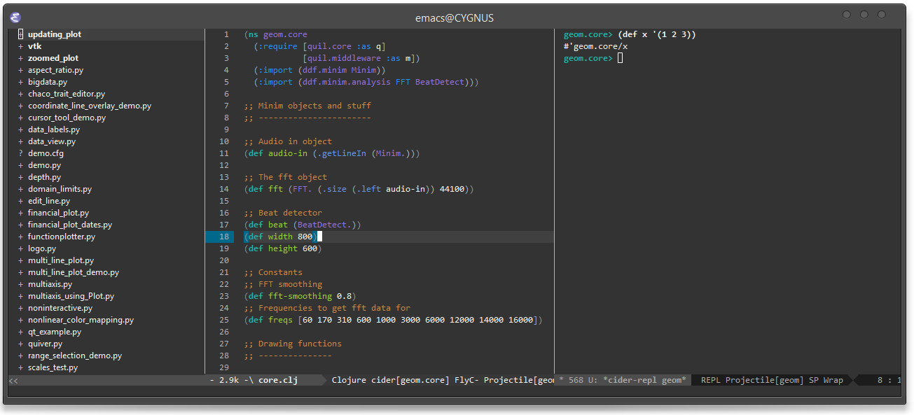

rogue
=====

Clutter free emacs configuration using [cask](https://github.com/cask/cask) and [pallet](https://github.com/rdallasgray/pallet).



##Inside

Rogue uses tweaked [graphene](https://github.com/rdallasgray/graphene).

Useful additions include [Elpy](https://github.com/jorgenschaefer/elpy), [Cider](https://github.com/clojure-emacs/cider), [Julia mode](http://melpa.org/#/julia-mode), [Org mode](http://orgmode.org/), [Markdown Mode](https://github.com/defunkt/markdown-mode), [Projectile](https://github.com/bbatsov/projectile) and [Magit](https://github.com/magit/magit).

##Setup

Install [cask](https://github.com/cask/cask)

```sh
$ git clone git@github.com:lepisma/rogue ~./emacs.d
$ cd ~./emacs.d
$ cask install
```
---

For `cider-jack-in` install [cider-nrepl](https://github.com/clojure-emacs/cider-nrepl).

For effective Elpy, install `rope` and `flake8` via pip.
